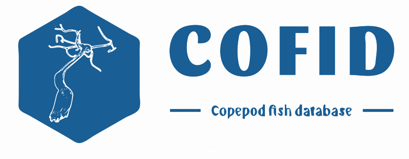

<!-- README.md is generated from README.Rmd. Please edit that file -->

```{r, include = FALSE}
knitr::opts_chunk$set(
  collapse = TRUE,
  comment = "#>",
  fig.path = "man/figures/README-",
  out.width = "100%"
)
```


<!-- badges: start -->
<!-- badges: end -->

This R packages contains an expert curated Copepod Fish database. This database
was taxonomically curated by [Francisco Neptalí Morales-Serna](https://orcid.org/0000-0002-2577-5369).
The data cleaning, standarization and wrapping as an R packages was done by [Ángel Luis Robles-Fernandez](https://orcid.org/0000-0002-4674-4270) 


## Installation

Install from CRAN:
``` r 
install.packages("cofid")
```

You can install the development version of cofid from [GitHub](https://github.com/) with:

``` r
# install.packages("devtools")
devtools::install_github("alrobles/cofid")
# load the data to your environment
data(cofid, "cofid")

```

## Dataset

The dataset contains $10, 344$ copepod - fish interaction records. The fields in the data set
are:

* source_taxon_external_id: the id number provided by [World Register of Marine Species](https://www.marinespecies.org/)
* source_taxon_name: The scientific name of the copepod species
* source_taxon_path: Taxonomical hierarchy of the copepod. Only contains 7 levels 
* source_specimen_life_stage: The life stage of the record
* interaction_type: The type of interaction between copepod and fish
The records are mainly ectoparasitic (7654). There are 74 endoparasitic and 7 parasitic
* target_taxon_external_id: The host fish id number provided by [World Register of Marine Species](https://www.marinespecies.org/)
* target_taxon_name: Host fish species scientific name
* target_taxon_path: Taxonomical hierarchy of the host fish. Only contains 7 levels
* study_citation: Original study where the record cand be found

## Functionality
`cofid` R package has two helping funtions.
* `getCopepods` let the user filter the dataset given a family, genus or species of copepod

```{r, include = TRUE}
library(cofid)
Caligus <- getCopepods(genus = "Caligus")
head(Caligus)
```
In addition, the user can also retrive the data withouth citation
for convenience:

```{r, include = TRUE}
Caligidae <- getCopepods(family = "Caligidae", citation = FALSE)
head(Caligidae)
```

* `getFish` let the user filter the dataset given a family, genus or species of fish:

```{r exampleFish}
library(cofid)
Molva_molva <- getFish(species = "Molva molva", citation = FALSE)
head(Molva_molva)
```

## Online access

You can try online the dataset.

<iframe src="https://alroble8.shinyapps.io/cofid_app/" height="100%" width="100%" scrolling="yes" title="Iframe Example"></iframe>


