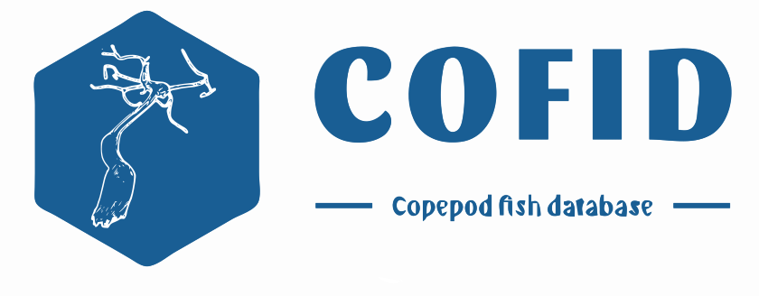

<!-- README.md is generated from README.Rmd. Please edit that file -->


<!-- badges: start --> <!-- badges: end -->

This R packages contains an expert curated Copepod Fish database. This
database was taxonomically curated by [Francisco Neptalí
Morales-Serna](https://orcid.org/0000-0002-2577-5369). The data
cleaning, standarization and wrapping as an R packages was done by
[Ángel Luis Robles-Fernandez](https://orcid.org/0000-0002-4674-4270)

## Installation

Install from CRAN:

``` r
install.packages("cofid")
```

You can install the development version of cofid from
[GitHub](https://github.com/) with:

``` r
# install.packages("devtools")
devtools::install_github("alrobles/cofid")
# load the data to your environment
data(cofid, "cofid")
```

## Dataset

The dataset contains $10, 344$ copepod - fish interaction records. The
fields in the data set are:

- source_taxon_external_id: the id number provided by [World Register of
  Marine Species](https://www.marinespecies.org/)
- source_taxon_name: The scientific name of the copepod species
- source_taxon_path: Taxonomical hierarchy of the copepod. Only contains
  7 levels
- source_specimen_life_stage: The life stage of the record
- interaction_type: The type of interaction between copepod and fish The
  records are mainly ectoparasitic (7654). There are 74 endoparasitic
  and 7 parasitic
- target_taxon_external_id: The host fish id number provided by [World
  Register of Marine Species](https://www.marinespecies.org/)
- target_taxon_name: Host fish species scientific name
- target_taxon_path: Taxonomical hierarchy of the host fish. Only
  contains 7 levels
- study_citation: Original study where the record cand be found

## Functionality

`cofid` R package has two helping funtions. \* `getCopepods` let the
user filter the dataset given a family, genus or species of copepod

``` r
library(cofid)
Caligus <- getCopepods(genus = "Caligus")
head(Caligus)
#>      source_taxon_name   target_taxon_name
#> 2073   Caligus affinis Pomatomus saltatrix
#> 2074   Caligus affinis     Umbrina cirrosa
#> 2075 Caligus alalongae    Thunnus alalunga
#> 2076 Caligus alalongae      Thunnus obesus
#> 2077 Caligus alalongae      Thunnus obesus
#> 2078 Caligus alalongae      Thunnus obesus
#>                                                                                                                                                                                                                                                       study_citation
#> 2073                                                                     Oldewage, W.H. & J.G. van As. (1989). Occurrence and distribution of Caligus (Copepoda: Siphonostomatoida) in African coastal waters. Revue de Zoologie Africaine 103(1):91-98, appendix 1.
#> 2074                                                                                                                    Kensley, B. & J.R. Grindley. (1973). South African parasitic Copepoda. Annals of the South African Museum 62(3):69-130, figs. 1-35. (x-1973)
#> 2075 Raibaut, A., C. Combes & F. Benoit. (1998). Analysis of the parasitic copepod species richness among Mediterranean fish. <em>In: Dahms, H.U., T. Glatzel, H.J. Hirche, S. Schiel & H.K. Schminke, (eds.). Proceedings of the 6th International Conference on Co
#> 2076                                                                     Oldewage, W.H. & J.G. van As. (1989). Occurrence and distribution of Caligus (Copepoda: Siphonostomatoida) in African coastal waters. Revue de Zoologie Africaine 103(1):91-98, appendix 1.
#> 2077                                                                                                                         Dippenaar, S.M. (2005). Reported siphonostomatoid copepods parasitic on marine fishes of southern Africa. Crustaceana 77(11):1281-1328.
#> 2078 Capart, A. (1959). Copépodes parasites. <em>Résultats Scientifiques de l'Expédition Océanographique Belge dans les Eaux Côtieres Afrricaines de l'Atlantique Sud (1948-1949). Institut Royale des Sciences Naturelles de Belgique.</em> 3(5):59-126, figs. 1-37
```

In addition, the user can also retrive the data withouth citation for
convenience:

``` r
Caligidae <- getCopepods(family = "Caligidae", citation = FALSE)
head(Caligidae)
#>         source_taxon_name    target_taxon_name
#> 2050 Caligodes laciniatus   Strongylura leiura
#> 2051 Caligodes laciniatus       Tylosurus acus
#> 2052 Caligodes laciniatus     Tylosurus choram
#> 2053 Caligodes laciniatus Tylosurus crocodilus
#> 2054 Caligodes laciniatus  Platybelone argalus
#> 2055 Caligodes laciniatus       Ablennes hians
```

- `getFish` let the user filter the dataset given a family, genus or
  species of fish:

``` r
library(cofid)
Molva_molva <- getFish(species = "Molva molva", citation = FALSE)
head(Molva_molva)
#>            source_taxon_name target_taxon_name
#> 562       Cresseyus confusus       Molva molva
#> 2214          Caligus curtus       Molva molva
#> 2387       Caligus elongatus       Molva molva
#> 4184 Lernaeocera branchialis       Molva molva
#> 4317       Lernaeocera lusci       Molva molva
#> 6962 Chondracanthus brotulae       Molva molva
```

## Online access

You can try online the dataset.

<iframe src="https://alroble8.shinyapps.io/cofid_app/" height="100%" width="100%" scrolling="yes" title="Iframe Example">
</iframe>
